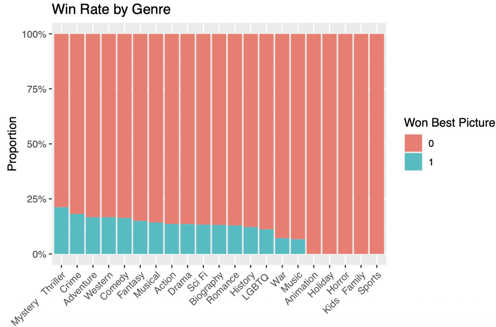
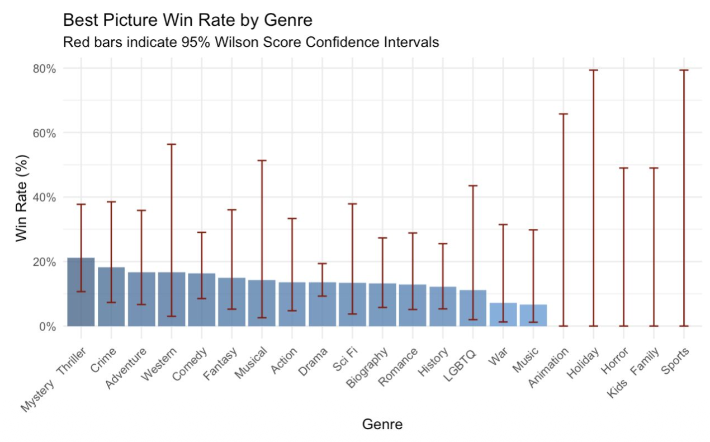
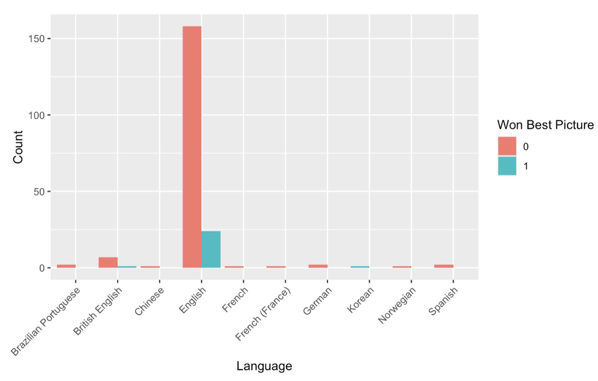
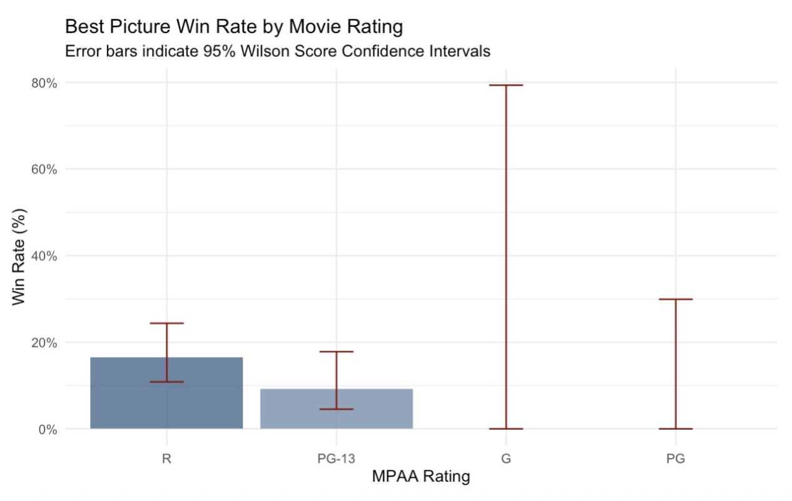
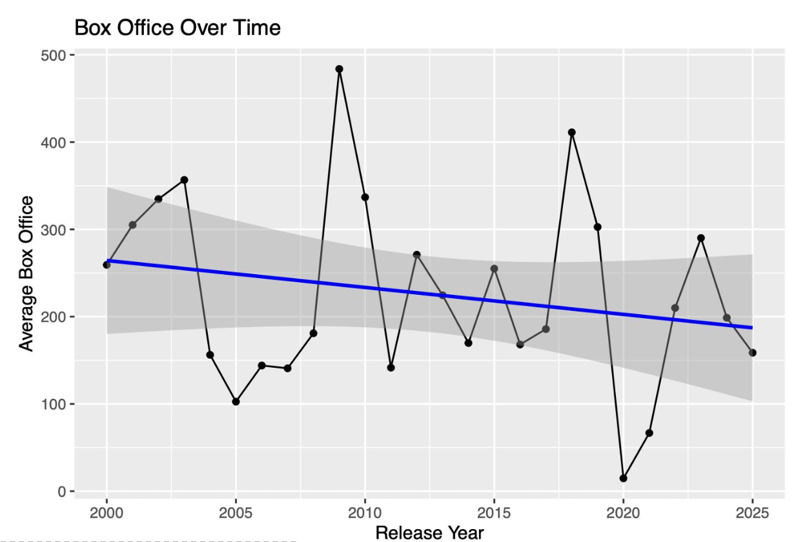
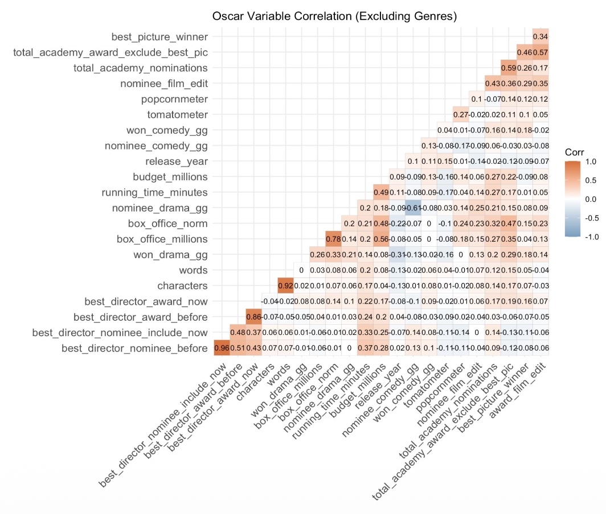
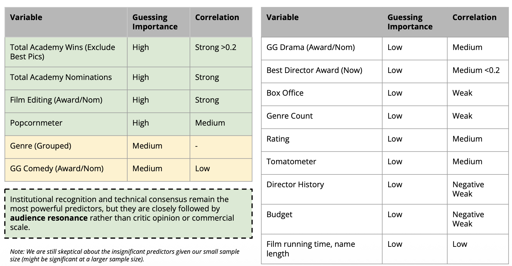

# Multivariate Academy Award Prediction: Modeling the Best Picture Oscar
An End-to-End Predictive and Statistical Framework Analyzing 21st-Century Nominees

## Problem Statement
The Academy Award for Best Picture is the film industry's most prestigious honor. While annual media speculation surrounding the awards is intense, most commercial predictions remain entirely subjective. This project moves beyond subjective reporting by using rigorous multivariate statistical modeling to identify the objective technical, institutional, and audience factors that differentiate actual Oscar winners from fellow nominees.

The primary analytical challenge is parsing high-dimensional data while controlling for intense confounding variables (such as a director's historical legacy or studio financial sheets) and avoiding structural look-ahead bias. By uncovering these underlying criteria, this repository establishes a statistically validated blueprint of how cinematic elements resonate with the voting body of the Academy.

## Methodology
To ensure high-fidelity inputs and clean statistical boundaries, the analytical pipeline followed these core phases:

(1) Granular Web Scraping & Data Pipeline: 
Extracted structural text files from the official Oscar Database. Programmatically gathered metadata (budgets, runtimes) from Wikipedia via R, historical tracking from the Golden Globe Database, and public sentiment profiles (Tomatometer/Popcornmeter) by crafting a custom URL slug override script for Rotten Tomatoes.  

(2) Visual Cue Extractions: 
Solved data-labeling omissions using programmatic visual parsing in R. Extracted Oscar winners by querying the presence of the span.glyphicon-star HTML class, and extracted Golden Globe winners by filtering lines for the specific Light Steel Blue hex code highlights (#B0C4DE) inside Wikipedia tables.  

(3) Time-Aligned History Accumulation: 
Built a dual-layered accumulation matrix ("before" vs. "include_now") to track a director's career momentum. This explicitly bounds historical tallies to the concurrent ceremony year, preventing future career wins from causing look-ahead bias in past prediction folds.  

(4) Categorical Matrix Condensation: Mitigated high-dimensional sparsity by running a one-hot tokenization script on raw movie strings. Consolidated 21 complex genres into 5 broad thematic groupings (Drama, Human Interest, Suspense, Entertainment, and Niche) and collapsed low-sample MPAA rows into a single PG and under bin.  

(5) Structural Interaction Checks: Employed the Likelihood Ratio Test to check multi-way interaction models, discovering a major structural shift before and after the Academy's 2009 expansion to a 10-nominee preferential voting system.  

## Dataset Overview
Dataset OverviewThe finalized database, academy_final.csv, contains 201 unique film observations spanning the 72nd (2000) through 98th (2025) Academy Awards. The underlying matrix features 45 predictors and 1 binary response variable (best_picture_winner).  

Features track:
- Acclaim & Industry Precursors: Best Film Editing nomination/win flags, Best Director current and historical wins, total non-Best Picture Oscar wins, and Golden Globe tallies.
- Reception Sentiment: Tomatometer (Critics) and Popcornmeter (Audience) percentages.
- Production Metadata: Year-normalized budget/box office tiers, runtime minutes, title character length, and language indicators.  

## Exploratory Data Analysis (EDA) & Uncertainty Framework
Before fitting predictive structures, we ran exhaustive distribution and correlation analyses to evaluate the isolated strength of our features. 

To prevent false assumptions about our dataset, we deployed a rigorous mathematical framework to handle categorical and non-normal variables:  

(1) Wilson Score Interval: 
For binary proportions and winning rates, we utilized the Wilson Score interval over the standard Wald approximation. This mathematical choice handles rare categorical splits safely, preventing "impossible" negative bounds and recognizing that even if a sub-category has zero wins in our sample, its true underlying win probability remains non-zero.  

(2) Non-Parametric Bootstrapping: 
For highly skewed, non-binary variables (such as raw financial sheets and award tallies), standard normal-theory metrics fail. We repeatedly resampled the data with replacement to build empirical sampling distributions, deriving our 95% confidence intervals directly from observed percentiles to realistically capture uncertainty.  

### Key Cinematic Findings:

(1) The Volume Illusion of Drama:
At a glance, the Drama genre dominates the raw winner counts. However, converting these counts to proportions reveals that Mystery/Thriller, Crime, and Adventure actually secure a higher win rate per submission. When computing the 95% Wilson Score intervals, the massive overlap and wide error bars reveal that genre alone is not a statistically distinct indicator of success.  

(2) Negligible Language Variance: 
The vast majority of nominated and winning films are strictly English-language productions. Because only two non-English titles won Best Picture within our sample timeframe, the language variable provides zero practical predictive information for the final model.  

(3) The Maturity Trend: 
Mosaic plot visualization demonstrates that Best Picture win rates scale upward as content restrictions become more mature, with R and PG-13 films getting selected far more frequently than G or PG entries. Even so, strict Wilson intervals overlap heavily, rendering MPAA rating mathematically insignificant on its own.  

(4) Streaming Disruption & Box Office Decay: 
Tracking revenue longitudinally exposes a steady decline in average box office returns for nominated titles over the 21st century—a shift tracking the erosion of the traditional theatrical window by major streaming services.  

(5) The Audience-Critic Misalignment: 
Mapping critical scores displays a dense clustering of both winners and losers in the top-right quadrant, implying that high critic acclaim is a baseline requirement to be nominated rather than an isolated driver of a win. Interestingly, the audience-driven Popcornmeter score showed a more visible statistical separation between winners and non-winners compared to the professional Tomatometer score. 

(6) Craft Excellence (The Sweep Effect): 
Broad institutional support across creative departments is the single strongest indicator of voter consensus. The average total awards won (excluding Best Picture itself) are substantially higher for winners than non-winners. This difference is highly statistically significant, as backed by completely non-overlapping 95% bootstrapped confidence intervals.  

(7) The Best Film Editing Prerequisite: 
Technical validation from editing peers acts as a crucial, reliable gatekeeper for a film's overall victory. Films nominated for or winning Best Film Editing see a sharp, step-wise surge in their Best Picture win rates, peaking at 45.5% for editing winners. This structural climb is verified by perfectly non-overlapping 95% Wilson Score intervals.  

(8) Directorial Momentum vs. Past Pedigree: While a director's historical legacy or past nominations offer no statistical separation or predictive advantage once a film is nominated, current-year momentum is incredibly powerful. Winning Best Director at the concurrent ceremony yields a powerful statistical signal, corresponding to a 33.3% Best Picture win probability within the sample.

### Correlation Plot

### Inference from EDA

For detailed visuals, analysis, and explanation, please refer to our deck or report. 

## Model Fitting

### Model Diagnostics & OLS Violations
Initially, an Ordinary Least Squares (OLS) linear regression model was fit against our primary predictors. However, strict diagnostic parsing revealed critical linear Regression Violations:  

- Heteroscedasticity: Severe non-random parallel tracking in Residuals vs. Fitted plots
- Non-Normality: Deep distributional skewing clearly confirmed via the Q-Q Residuals plot
- Conclusion: Parametric linear constraints rejected; transitioned to binomial logistic models

Upon moving to a Binomial Logistic Regression model, standard assumptions were cleanly satisfied. Diagnostic checking of the Pearson residuals confirmed that continuous variables safely maintain a linear relationship with target log-odds, showing uniform distribution and zero multicollinearity.

### Performance Metrics & Model Comparison
(1) Final Logistic Regression
Optimized via backward subset selection and L1 LASSO regularization to minimize the Akaike Information Criterion, the final model achieved an AIC of 104.92.  

Using an optimal decision threshold of 0.1129, the classification performance balances sensitivity and specificity to ensure potential winners are not ignored:  
- Global Classification Accuracy: 85.0%
- True Positive Rate (Sensitivity): 92.3%
- True Negative Rate (Specificity): 84.0%
- False Negative Rate (Surprise Loss): 7.69%
- Training Area Under Curve (ROC-AUC): 0.925
- Validation Area Under Curve (ROC-AUC): 0.885

(2) Random Forest Sanity Check
To validate the logistic boundaries against non-linear patterns, a stratified Random Forest model was trained on an even split of 26 winners and 26 losers.  

The Mean Decrease Gini chart matched the logistic findings, ranking non-Best Picture wins and budgets as top features. However, the Random Forest performed notably worse, yielding a higher Out-Of-Bag (OOB) error rate of 20.4% and a low True Positive Rate of 65.4%. This performance gap confirms that for smaller, specialized datasets, logistic regression remains the more robust choice. 

For actual regression results, please refer to the deck and report. 

## Core Oscars' Best Picture Predictors
The statistical analysis exposes a sharp contrast between genuine institutional signals and high-profile industry metrics:

(1) Significant Success Predictors ($\alpha = 0.05$)
- Craft Excellence (The Sweep Effect): Every single non-Best Picture Academy Award won by a film in the same year more than doubles its odds of winning Best Picture ($\text{Odds Ratio} = 2.23$). Broad institutional support across creative departments is the single strongest signal of voter consensus.
- The Film Editing Prerequisite: Securing a nomination in Best Film Editing multiplies a film's winning odds by 5.17 times ($\beta = 1.642$). Technical acclaim in editing acts as a vital baseline milestone for top honors.
- Current Directorial Momentum: Winning Best Director at the concurrent ceremony boosts Best Picture odds by 5.07 times ($\beta = 1.622$). However, a director's long-term past pedigree (previous career wins or nominations) offers no statistical advantage once a movie is nominated.

(2) The Post-2009 "Budget Penalty"
The Likelihood Ratio Test uncovered a highly significant interaction between a film's normalized budget and the post-2009 era ($p = 0.004$). Prior to 2009, budgets between winners and losers were entirely comparable.  

However, following the shift to preferential ranking ballots and an expanded 10-nominee pool, a distinct budget penalty emerged:  
- Pre-2009 Era: Budget Odds Effect = 0.293 (Statistically Insignificant)
- Post-2009 Era: Budget Odds Effect = <0.001 (Highly Significant Penalty)
  
This mathematical shift proves the Academy has stepped away from high-budget studio epics, opting instead for smaller-scale, auteur-driven personal narratives that build a stronger voter consensus across ranked ballots

## Repository Structure & Resources
- academy_final.csv: The primary high-dimensional matrix containing 201 observations and the engineered text/thematic predictors.
- report.pdf: The full academic report detailing extraction hurdles, OLS violations, and deviance analyses.
- data_extraction_file/: Source files mapping raw programmatic text extractions from online databases.
- merging/: Data repository hosting individual unmerged .csv files sorted by key precursors, databases, and variables.
- eda.Rmd: R Markdown notebook exploring language weights, mosaic rating spreads, and Wilson Score confidence intervals.
- model.Rmd: R Markdown model sandbox executing multivariate logistic regressions, backward selection passes, and Gini Random Forest trees.

## Contributions & Acknowledgements
This project represents a joint collaboration between Henry Tan (modeling, statistical testing, and EDA) and Casper Liao (data engineering, tokenization, and multi-source scraping).  Completed as the final capstone project for STSCI 4100: Multivariate Analysis at Cornell University. We thank our advisor, Dana Yang, Assistant Professor at Cornell University, for their insights into structural award trends. 

